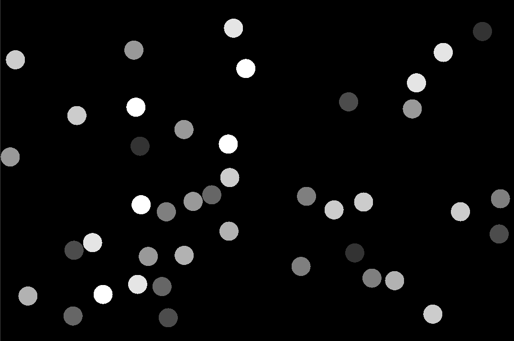

# Bouncing Ball Simulation
A simple simulation of balls bouncing in a window, made in OpenGL

## Build
Build using CMake. Start the commands from the project's root directory.

    mkdir build && cd build
    cmake -G<generator> ..
    <command for your generator>

Recommended generators are Ninja (ninja) and make.
The binary will be output in the bin directory in the build directory.

## Usage
Run the executable from the binary directory, so that it can read the vertex and fragment shader files.

## Visuals

